# TreeMind 使用教程

TreeMind 是一款从 Python 源码运行的桌面思维导图软件。你可以手动整理知识，也可以让大模型生成、重组和拆解节点，再加入图标、截图与配图。

本教程对应当前项目版本。所有截图均来自软件实际界面，使用专门制作的「Python 学习计划」示例，不包含真实密钥。AI 结果预览使用人工编写的演示内容，不代表真实接口返回或生成质量。

## 目录

- [1. 安装与启动](#1-安装与启动)
- [2. 认识界面与建立第一张导图](#2-认识界面与建立第一张导图)
- [3. 设置颜色、形状和记忆图标](#3-设置颜色形状和记忆图标)
- [4. 连接文字大模型](#4-连接文字大模型)
- [5. 用 AI 生成、整理和拆解节点](#5-用-ai-生成整理和拆解节点)
- [6. 插入、查看和删除节点图片](#6-插入查看和删除节点图片)
- [7. 搜索网上图片](#7-搜索网上图片)
- [8. 根据节点与下级内容生成配图](#8-根据节点与下级内容生成配图)
- [9. 展开折叠与关联连线](#9-展开折叠与关联连线)
- [10. 保存、重新打开和导出](#10-保存重新打开和导出)
- [11. 快捷键速查](#11-快捷键速查)
- [12. 常见问题](#12-常见问题)
- [13. 将教程和截图上传到 GitHub](#13-将教程和截图上传到-github)

## 1. 安装与启动

### 使用 Windows 安装包

获得 `TreeMind-Setup-1.0.0-x64.exe` 后，双击并按中文向导安装，完成后从桌面或开始菜单启动 TreeMind。无需安装 Python；AI 功能需要填写自己的 API Key。安装包适用于 Windows 10（2004及以上）/11 x64。需要维护源码时，再使用下方源码运行方式。详细说明见 [Windows 安装包说明](PACKAGING.md)。

### 第一次在其他电脑运行

安装独立的 **Python 3.12（64 位）**，下载或克隆完整项目，在包含 `main.py` 和 `requirements.txt` 的目录打开 PowerShell，然后依次执行：

```powershell
python -m venv .venv
.\.venv\Scripts\python.exe -m pip install -r requirements.txt
.\.venv\Scripts\python.exe main.py
```

以后启动只需要执行最后一行。项目不需要打包为 EXE，也不需要启动网页服务器。普通导图编辑可以离线使用；联网搜索和 AI 功能需要网络。

当前电脑可以双击项目根目录的「启动TreeMind.lnk」。该快捷方式绑定本机路径，移动项目或换电脑后请使用上述命令启动，或重新建立快捷方式。

### 打开教程示例

本教程附带 [example.mindmap.json](example.mindmap.json)。下载后，在软件中点击「打开」并选择该文件，即可练习。建议先「另存为」自己的副本。

## 2. 认识界面与建立第一张导图

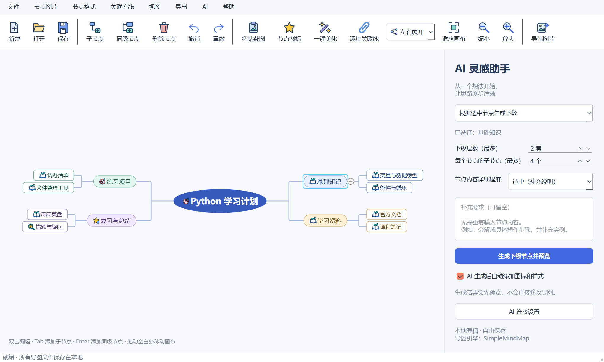

| 区域 | 用途 |
| --- | --- |
| 顶部菜单 | 文件、节点图片、节点格式、关联连线、视图、导出、AI |
| 图标工具栏 | 常用编辑、粘贴截图、美化、布局、缩放和导出操作 |
| 中间画布 | 选择节点、编辑文字、拖动和查看内容 |
| 右侧 AI 灵感助手 | 选择 AI 操作、设置详细程度、填写要求、生成预览 |

### 手动建立节点

1. 点击「新建」。如果旧导图尚未保存，按提示先保存。
2. 双击中心节点，把标题改为自己的主题，例如「Python 学习计划」。
3. 选中中心节点，按 **Tab** 添加子节点，输入「基础知识」。
4. 选中「基础知识」，按 **Enter** 添加同级节点，例如「练习项目」。
5. 选中「基础知识」，按 **Tab** 添加它的下级，例如「变量与数据类型」。
6. 继续建立其他分支，按 **Ctrl+S** 保存。

顶部「子节点」「同级节点」「删除节点」按钮也可完成相同操作。误操作可以按 **Ctrl+Z** 撤销，按 **Ctrl+Y** 重做。删除节点会涉及其下级内容；只想删除配图时，请使用图片删除入口。

### 让根节点向左右分支

工具栏布局下拉框选择 **「左右展开」**。给根节点添加多个一级子节点后，分支会分布到两侧。只有一个一级子节点时，只显示一条主分支是正常现象。

还可以切换「向右展开」「向左展开」。布局会随导图一起保存。画面偏移或节点显示不全时，点击「适应画布」。

### 复制当前节点及全部下级内容

右键目标节点，选择 **「复制节点及下级内容」**，然后到笔记、聊天窗口或文本编辑器中按 **Ctrl+V** 粘贴。

复制结果是 Markdown 文字大纲：当前节点作为标题，下级按层级缩进。所有层级的下级都会复制，包括折叠隐藏的节点；不会包含其他分支，也不会复制图片、图标和样式。复制根节点即可得到整张导图的文字大纲，复制操作不修改导图。

## 3. 设置颜色、形状和记忆图标

### 右键修改单个节点

右键点击目标节点，选择要修改的项目：


- **背景颜色、文字颜色、边框颜色**：在颜色窗口选色并确认。
- **节点形状**：可选圆角矩形、矩形、椭圆、菱形、平行四边形。
- **设置图标**：打开图标选择窗口。
- **恢复默认颜色和形状**：重置样式，保留文字、图标和图片。

### 添加记忆图标

1. 选中节点，点击工具栏「节点图标」，或按 **Ctrl+Shift+I**。
2. 在「记忆贴纸」或其他分类中点击图标；再次点击可取消选中。
3. 每个节点最多组合 **6 个图标**。
4. 点击「应用」确认；取消不会修改节点。

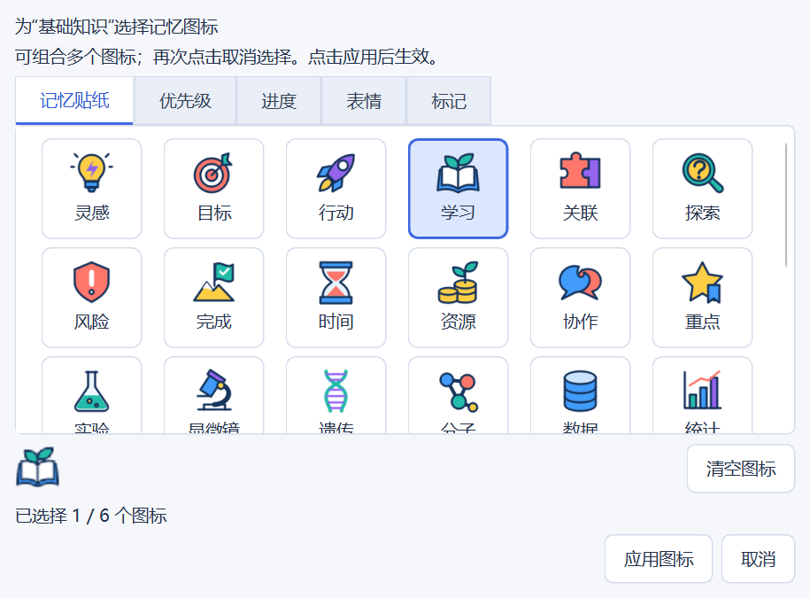

「记忆贴纸」包含 36 枚彩色矢量图标，也保留了原有图标分类。图标与节点文字、截图可以同时存在。

### 一键美化

点击「一键美化」或按 **Ctrl+Shift+B**，根据文字关键词添加图标、按分支配色并设置形状。已有手动图标会保留，颜色和形状可能更新；不满意可整次撤销。

右侧「AI 生成后自动添加图标和样式」可控制 AI 新内容的自动美化。美化采用本地规则，本身不调用大模型。

## 4. 连接文字大模型

点击右侧底部 **「AI 连接设置」**。

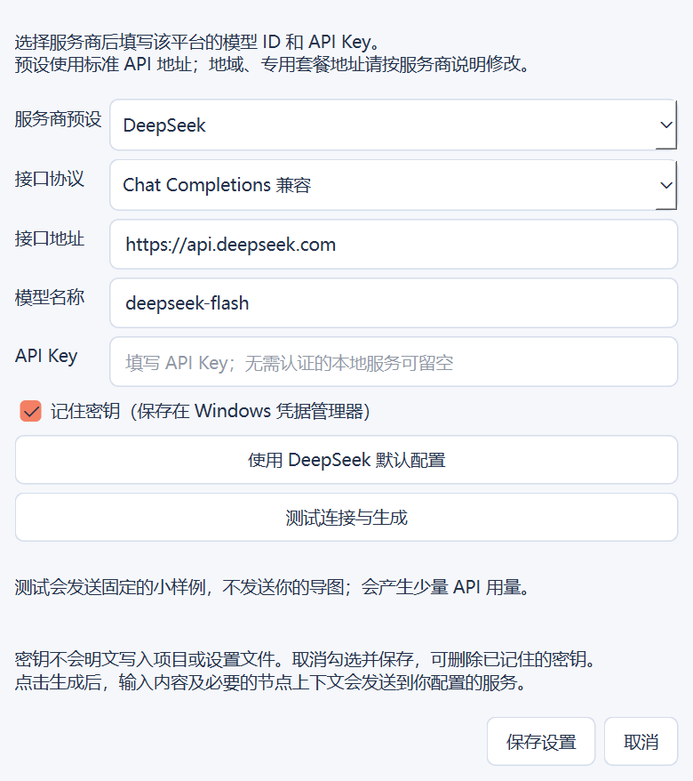

1. 选择服务商预设。当前提供 DeepSeek、OpenAI、通义千问、Gemini、Claude、智谱、豆包与自定义入口。
2. 核对「接口协议」「接口地址」和「模型名称」。模型名称应填写你账号实际可调用的模型 ID；截图中的值仅展示项目当前默认配置。
3. 填写该平台的 **API Key**。
4. 如需下次自动读取，勾选「记住密钥」。当前持久记忆使用 Windows 凭据管理器。
5. 点击「测试连接与生成」。测试会发送固定小样例，可能产生少量模型用量。
6. 测试成功后点击「保存设置」。

软件支持 **Chat Completions 兼容协议**和 **Claude Messages 协议**。服务商名称相同不代表所有接口都兼容；地域、专用套餐、私有协议可能需要不同配置。预设也不代表账号已开通模型权限。

文字模型密钥不写入导图 JSON。切换接口后需要该地址对应的密钥；取消「记住密钥」并保存，会删除当前接口已记住的凭据。

## 5. 用 AI 生成、整理和拆解节点

四种操作都需要先选中一个节点。**点击生成 → 检查预览 → 确认应用**，结果不会未经确认直接写进导图。

| 模式 | 适合什么情况 | 应用后的效果 |
| --- | --- | --- |
| 根据选中节点生成下级 | 只有主题，希望补充知识点 | 追加或合并下级内容，保留已有内容 |
| 整理选中节点的下级内容 | 已有很多子节点，分类或顺序不合理 | 重排下级结构与文字，可新增分类节点 |
| 拆解并拓展当前节点 | 当前节点是一大段长文字 | 当前节点改为短标题，细节下沉到下级并补充内容 |
| 将粘贴文本整理为下级导图 | 复制了一段资料，想挂在某个节点下面 | 从粘贴原文提炼层级，追加到选中的节点下 |

### 5.1 根据选中节点生成下级

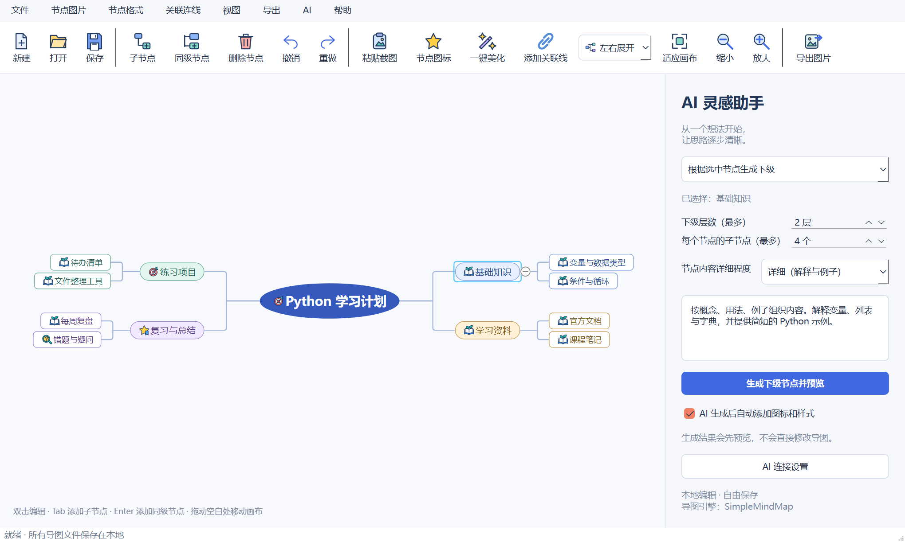

1. 在画布中点击目标节点，确认右侧「已选择」显示正确标题。
2. 选择「根据选中节点生成下级」。
3. 设置下级层数，范围 **1–4 层**。
4. 设置每个节点最多几个子节点，范围 **1–100 个**。这是上限，不要求每个节点凑满；单次新增总量仍最多 **120 个**。
5. 选择节点内容详细程度：简洁、适中、详细。
6. 可选填写补充要求，点击「生成下级节点并预览」。

此模式会自动参考从根到当前节点的上级路径、当前节点的已有下级，以及同一父节点下平行分支的文字概览，以减少跑题和重复。平行分支概览最多30个，每个包含本节点文字及最多5个直接下级要点，每段最多200字，总文字最多10000字；超出时会标记概览不完整。仅作为参考，不会修改平行节点，也不会发送它们的图片。

可直接使用的要求：

> 按概念、用法、例子组织内容。分类标题简短，具体知识点写详细，提供一个容易理解的示例，避免重复。

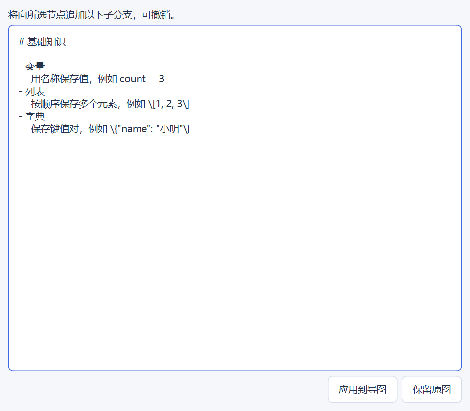

预览中检查分类、事实和重复内容。点击 **「应用到导图」**确认，或点击 **「保留原图」**放弃。应用后仍可撤销。

详细程度是提示模型的建议，不是精确字数保证。单节点最多 1000 字。希望写得更详细时，建议减少单次层数和分支数，集中展开一个小分支。

### 5.2 整理已有的下级内容

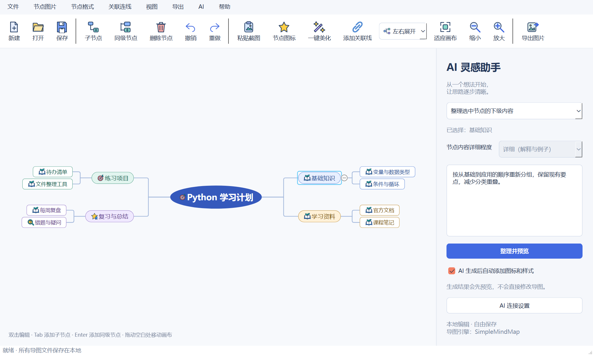

1. 选中有下级内容的节点。
2. 模式切换为「整理选中节点的下级内容」。
3. 填写要求，例如「按基础、方法、应用重新分组，减少分类重叠」。
4. 点击整理按钮，核对预览，再应用。

该操作保留选中节点标题和已有节点编号，也保留原节点的图片、图标、样式与关联线。现有节点可以改写和重排，但当前版本不自动删除或合并原节点。

### 5.3 拆解长文字并拓展

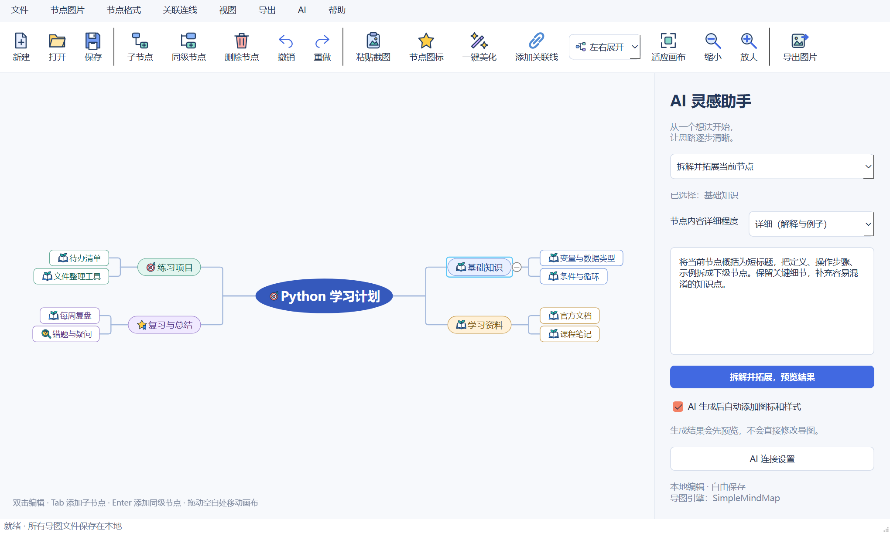

1. 选中内容过长的节点，即使它没有子节点也可以操作。
2. 选择「拆解并拓展当前节点」。
3. 填写具体拆解要求，点击「拆解并拓展，预览结果」。
4. 在预览中对照原文，确认关键参数与事实没有丢失，再应用。

例如：

> 将当前节点概括为短标题，把定义、操作步骤、示例拆成下级节点。保留关键细节，补充容易混淆的知识点，不要添加“拓展：”等前缀。

整理和拆解适合分批处理较小的子树。它们有独立的结构限制，生成下级模式中的「最多100个」不适用于所有操作。生成过程中若导图发生修改，程序可能拒绝应用旧结果；请重新选择节点生成。

### 5.4 将粘贴文本整理到选中节点下面

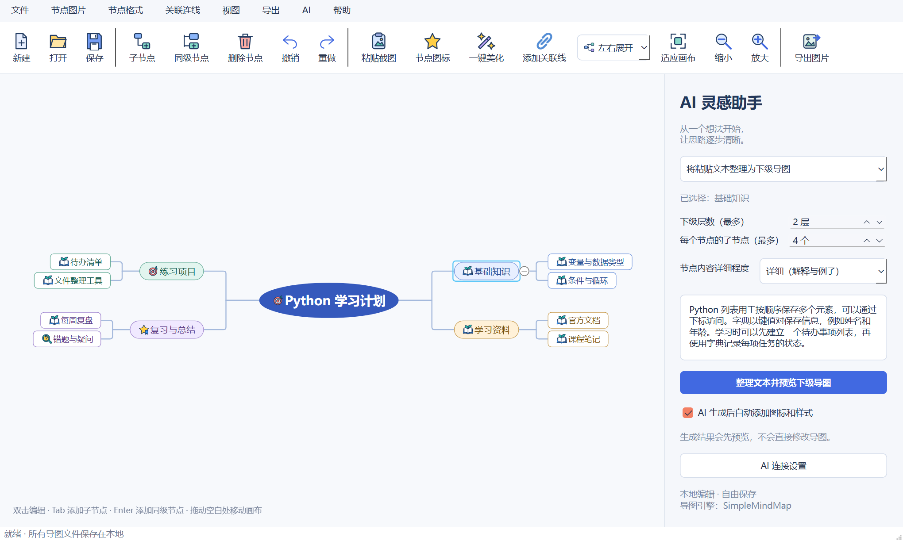

1. 点击要放置内容的节点，例如「基础知识」。
2. 在 AI 模式下拉框选择 **「将粘贴文本整理为下级导图」**。
3. 在右侧大文本框粘贴资料原文，最多30000字；不用先把原文写进节点。
4. 选择下级层数（1–4）、每个父节点的子节点上限（1–100），以及内容详细程度。
5. 点击 **「整理文本并预览下级导图」**，检查分类、关键数字和细节，再点击「应用到导图」。

此模式以粘贴原文为事实来源，不主动补充资料外的知识。所选节点的标题和已有内容保持不变，整理结果追加到该节点下；同名分支按现有合并规则接收新的下级内容。折叠的已有节点不会被删除。应用可撤销，结果随 JSON 保存。

单次新增总量最多120个，超过层数或数量上限的模型输出会被限制，因此长资料建议分段整理，并核对预览是否覆盖关键内容。生成或预览期间若修改了导图，本次结果会被拒绝，避免覆盖编辑。切换选中节点不会改变本次结果原定的挂载位置。

## 6. 插入、查看和删除节点图片

### 粘贴截图

1. 使用 **Win+Shift+S** 截取需要的区域。
2. 回到软件，在画布中单击目标节点。
3. 按 **Ctrl+V**，或点击工具栏「粘贴截图」。
4. 保存导图，图片就会一起保存。

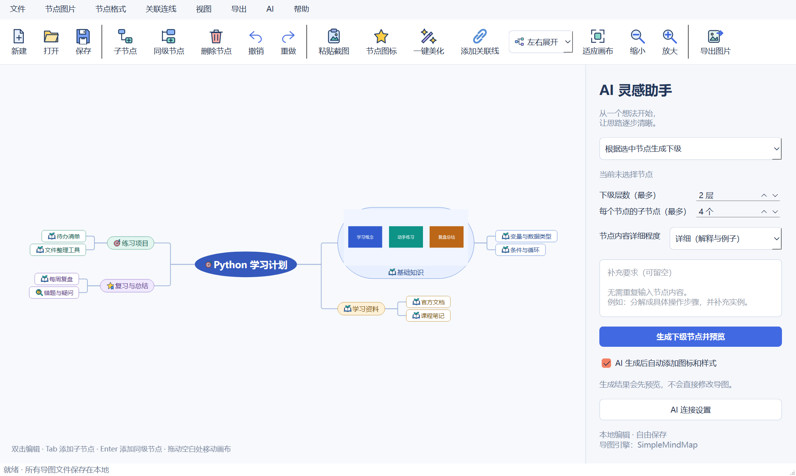

每个节点目前支持一张图片。再次粘贴会替换原图，可撤销。请让焦点位于画布；在 AI 文本输入框中粘贴不会把图片加到节点上。

### 点击查看大图

直接单击节点上的图片，打开查看窗口：

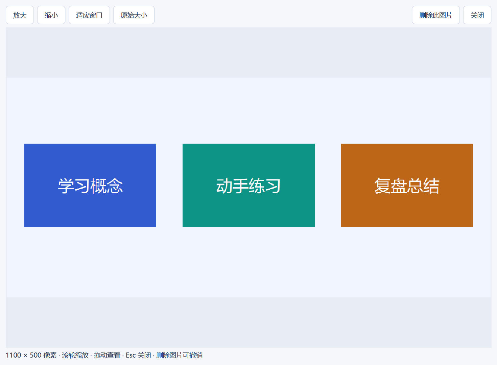

- 滚动鼠标滚轮，或点击「放大」「缩小」。
- 放大后拖动查看其他区域。
- 点击「适应窗口」看全图，点击「原始大小」按保存的像素尺寸查看。
- 按 **Esc** 或点击「关闭」返回导图。

查看的是导图中保存的图片。网上搜索下载的可能是预览尺寸，放大不会补回原本不存在的细节。

### 只删除图片，保留节点


可使用以下任一入口：

- 右键带图片的节点 → **删除此节点图片**。
- 打开大图 → **删除此图片**。
- 选中节点 → 顶部「节点图片」→「移除节点图片」。

这些操作只移除图片及其来源信息，保留文字、样式和下级节点。误删后按 **Ctrl+Z** 恢复，并记得重新保存。

## 7. 搜索网上图片

选中节点，右键选择「搜索网上图片」，也可按 **Ctrl+Shift+P**。

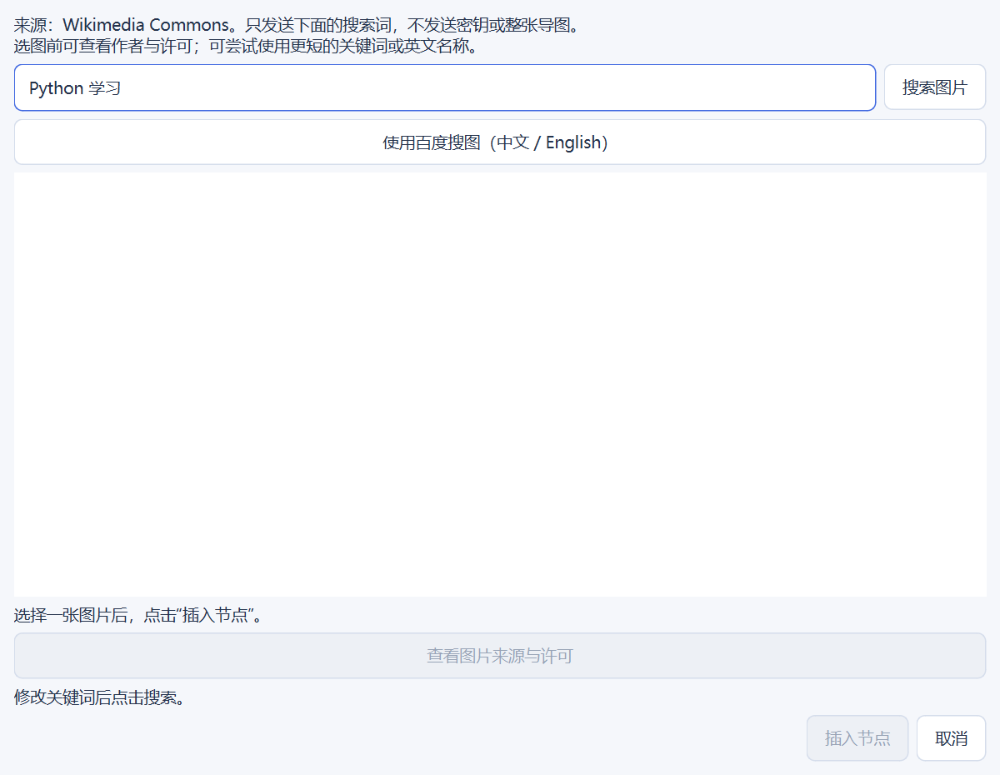

### Wikimedia Commons

1. 修改搜索框中的关键词，建议使用简短主题词。
2. 点击搜索，等待候选图片加载。
3. 选择图片，查看作者、许可和来源。
4. 点击「插入节点」。已有图片时按提示确认替换。

搜索无结果时，可以缩短词语或换成英文。例如长段实验描述可缩短为「microscope」或具体对象名。搜到图片但下载失败与没有结果不同，前者可稍后重试。

### 百度中文或英文搜图

1. 在同一窗口输入关键词。
2. 点击 **「使用百度搜图（中文 / English）」**。
3. 在内置网页中找到图片并打开大图。
4. 右键图片，选择「选用这张图片」。
5. 核对预览后点击「插入节点」。

网页无法使用时，可点「在浏览器中打开」，复制图片，再回到窗口点「使用已复制的图片」。百度结果是否允许使用，应以原始来源的授权为准。

## 8. 根据节点与下级内容生成配图

选中目标节点，右键选择 **「根据当前分支生成配图」**，或从顶部「节点图片」菜单进入。

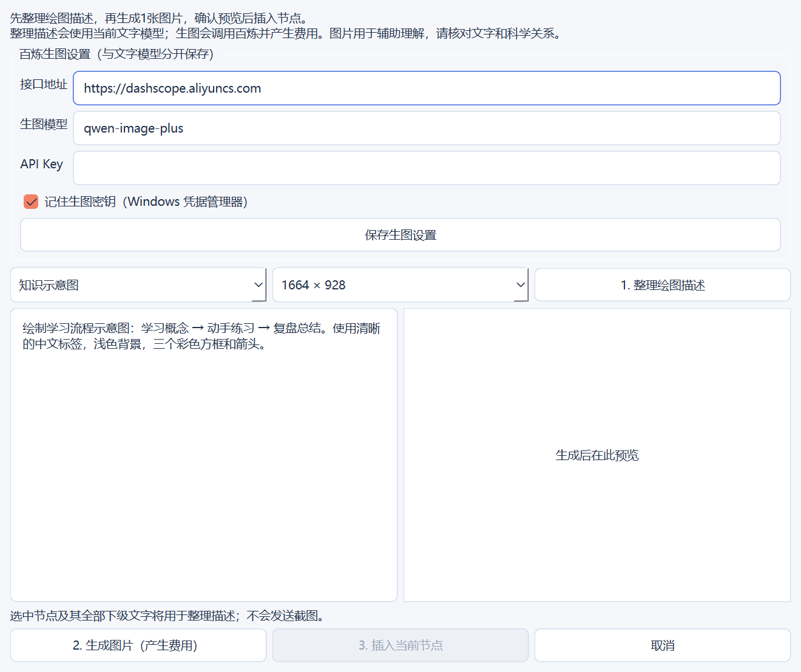

### 配置生图服务

文字模型和生图模型使用各自的配置与密钥。当前生图窗口适配百炼 Qwen-Image 同步接口；截图展示项目内置默认地址和模型，实际可用性取决于账号、地域及模型权限。不能直接把任意文字接口填到这里。

1. 填写生图接口地址、模型名称和对应 API Key。
2. 按需勾选「记住生图密钥」，点击「保存生图设置」。
3. 选择知识示意图、流程图或记忆插画，以及图片尺寸。

### 分三步生成

1. **整理绘图描述**：调用当前文字模型，根据选中节点及全部下级文字整理描述；也可以直接手动填写。
2. **生成图片（产生费用）**：检查并修改描述后再点击。每次生成一张，不自动重试。
3. **插入当前节点**：核对预览，确认后插入；已有图片时确认替换。

绘图描述最多600字。节点中的截图不会用于该文字描述步骤。生成结果中的文字和知识关系仍需人工核对。取消插入不修改导图，但不会撤销已经发生的接口费用。

## 9. 展开折叠与关联连线

### 展开与折叠

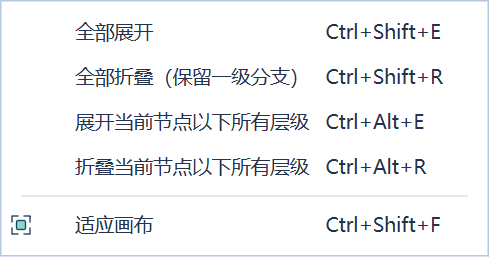

顶部「视图」菜单可操作整图或当前分支：

- 全部展开：显示所有层级。
- 全部折叠：保留根节点及一级分支。
- 展开当前节点以下所有层级：先选中目标节点。
- 折叠当前节点以下所有层级：只影响选中分支。

折叠仅隐藏内容，不会删除节点。状态支持撤销并随文件保存。

### 连接任意两个节点

1. 点击起点节点。
2. 点击「添加关联线」，或按 **Ctrl+L**。
3. 点击目标节点，完成连接。
4. 取消连接操作可按 Esc 或点击空白处。

删除时先选中关联线，再按 Delete，或使用「关联连线 → 删除选中关联线」。关联线表达跨分支关系，不改变父子层级。

## 10. 保存、重新打开和导出

### 保存可继续编辑的导图

- **Ctrl+S**：保存；首次保存需要选择目录和文件名。
- **Ctrl+Shift+S**：另存为，保留不同版本。
- **Ctrl+O**：打开此前保存的 JSON 导图。

一个 JSON 文件包含节点文字、图标、样式、关联线、布局、折叠状态和嵌入图片。复制给别人时，不需要另外复制节点配图文件夹。

建议重要修改前另存一份，例如 `学习计划-v1.json`。自动恢复副本用于意外退出恢复，不能代替主动保存与备份。

### 导出用于分享的文件


| 格式 | 适合用途 | 内容 |
| --- | --- | --- |
| JSON 保存文件 | 继续编辑、备份、给软件重新打开 | 完整导图数据与嵌入图片 |
| PNG 导出图片 | 插入报告、聊天分享 | 当前展开的节点、图片及图形样式 |
| Markdown 导出 | 文字笔记、知识大纲 | 树状文字，不包含节点图片和图形样式 |

需要导出全部内容时，先全部展开，再导出 PNG。这里的 Markdown 大纲导出与本篇带截图教程是两件事；软件不会自动为每份导图生成这样的截图教程。

## 11. 快捷键速查

编辑与结构快捷键请在画布中使用；文本框获得焦点时，部分按键会用于编辑文字。

| 操作 | 快捷键 |
| --- | --- |
| 新建 / 打开 / 保存 | Ctrl+N / Ctrl+O / Ctrl+S |
| 另存为 | Ctrl+Shift+S |
| 添加子节点 / 同级节点 | Tab / Enter |
| 撤销 / 重做 | Ctrl+Z / Ctrl+Y |
| 粘贴节点截图 | Ctrl+V |
| 节点图标 | Ctrl+Shift+I |
| 一键美化 | Ctrl+Shift+B |
| 根据选中节点生成下级 | Ctrl+Shift+G |
| 搜索网上图片 | Ctrl+Shift+P |
| 添加关联线 | Ctrl+L |
| 全部展开 / 全部折叠 | Ctrl+Shift+E / Ctrl+Shift+R |
| 展开当前分支 / 折叠当前分支 | Ctrl+Alt+E / Ctrl+Alt+R |
| 适应画布 | Ctrl+Shift+F |
| 关闭大图窗口 | Esc |

## 12. 常见问题

### 打开文件后看不到内容

先点击「适应画布」，再尝试「全部展开」。确认打开的是本软件保存的 JSON，而不是导出的 PNG 或 Markdown。若出现错误弹窗，保留原文件并记录报错；不要用空白导图覆盖原文件。

### 为什么每次启动仍要填密钥

确认填写后勾选「记住密钥」并点击「保存设置」。凭据按接口地址隔离，换地址后需要对应密钥。文字模型和生图模型各自保存；当前记忆机制依赖 Windows 凭据管理器。

### 设置最多100个，为什么没有生成100个

100是每个父节点的允许上限，不是固定数量；单次新增总量最多120个。模型可能因主题、深度和输出长度生成更少。建议先生成主要分类，再逐个展开。

### 图片和文件会不会太大

图片嵌入 JSON，会增加文件体积。节点显示缩略图最多320×220；保存时超4096像素的图片会等比例缩小。当前单图 PNG 最多8MB，所有图片编码总量最多32MB，整个导图文件最多40MB。

### AI 会看到什么

生成时会发送输入要求以及所需节点文字上下文。整理、拆解会发送所选子树，配图描述会使用所选节点及下级文字。当前这些文字模型流程不发送节点截图，也不提供图片识别。普通本地编辑不会自动调用 AI。

### 在别人电脑上打不开快捷方式

`.lnk` 包含本机路径，不能当作通用安装程序。让对方下载完整源码，创建自己的虚拟环境，然后运行 `main.py`。

## 13. 将教程和截图上传到 GitHub

请保留下面的目录关系，一起提交 Markdown 文件和图片文件夹：

```text
项目根目录/
├── README.md
└── docs/
    ├── USER_GUIDE.md
    ├── example.mindmap.json
    └── images/
        ├── 01-overview.png
        ├── 02-node-menu.png
        ├── ...
        └── 16-pasted-text.png
```

教程使用的是相对于本文件的图片路径，例如：

```markdown

```

因此把整个 `docs` 文件夹上传后，GitHub 打开 `docs/USER_GUIDE.md` 就能显示图片，不依赖本机盘符或外部图床。文件名与路径大小写应保持一致。如果把本教程移动到根目录，图片链接也要相应改为 `docs/images/...`。

根目录 README 已加入教程入口。上传时不要只复制 Markdown 正文；图片也必须进入仓库。通过网页上传可以在仓库根目录选择上传整个 `docs` 文件夹，再提交修改。使用 Git 的用户可在已有仓库根目录运行：

```bash
git add README.md docs scripts/capture_user_guide.py
git commit -m "docs: add illustrated user guide"
git push
```

这些命令假定仓库、远程地址和登录权限已经配置好。本次文档制作没有自动上传或创建 GitHub 仓库。

### 以后更新截图

项目提供可复用的截图脚本：

```powershell
.\.venv\Scripts\python.exe scripts/capture_user_guide.py
```

脚本会短暂打开真实软件窗口，用隔离设置和示例数据重新生成16张截图及示例 JSON，不调用搜索或 AI 接口，也不读取真实密钥。重新生成会覆盖 `docs/images` 中同名截图；界面功能变化后，应同步检查本教程文字。
